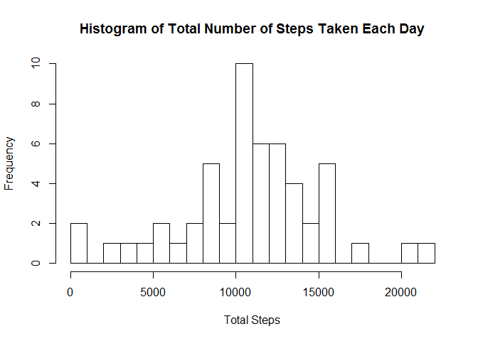
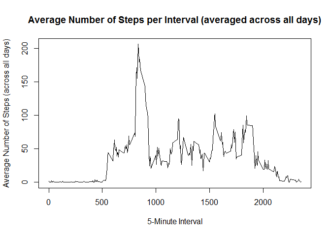
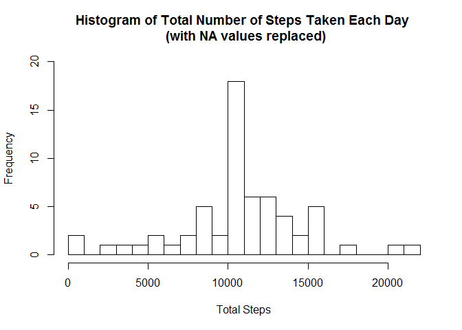
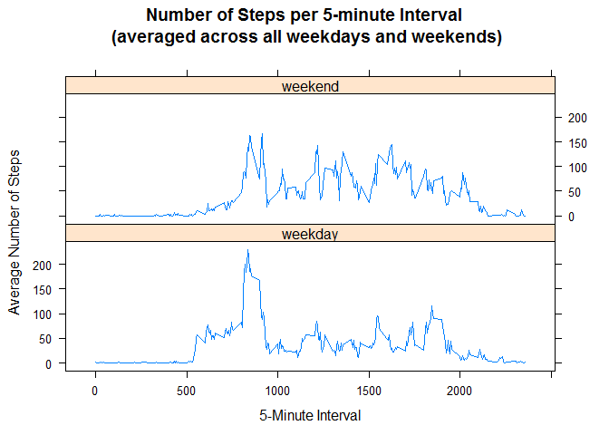

# Reproducible Research: Peer Assessment 1
Paul Duff  
February 14, 2016  

## Introduction:

It is now possible to collect a large amount of data about personal movement using activity monitoring devices such as a Fitbit, Nike Fuelband, or Jawbone Up. These type of devices are part of the "quantified self" movement - a group of enthusiasts who take measurements about themselves regularly to improve their health, to find patterns in their behavior, or because they are tech geeks. But these data remain under-utilized both because the raw data are hard to obtain and there is a lack of statistical methods and software for processing and interpreting the data.  
  
  
This assignment makes use of data from a personal activity monitoring device. This device collects data at 5 minute intervals through out the day. The data consists of two months of data from an anonymous individual collected during the months of October and November, 2012 and include the number of steps taken in 5 minute intervals each day.  
  

The data for this assignment can be downloaded from the course web site:

[Dataset: Activity monitoring data (52K)](https://d396qusza40orc.cloudfront.net/repdata%2Fdata%2Factivity.zip)
  
  
The variables included in this dataset are:
  
  
* steps: Number of steps taking in a 5-minute interval (missing values are coded as NA)
* date: The date on which the measurement was taken in YYYY-MM-DD format
* interval: Identifier for the 5-minute interval in which measurement was taken

The dataset is stored in a comma-separated-value (CSV) file and there are a total of 17,568 observations in this dataset.  
  
Assignment instructions can be found in the README.md file located in the repository as this document.

### Load librarys needed used during assignment code

```r
## apply packages
library(dplyr)
```

```
## Warning: package 'dplyr' was built under R version 3.2.3
```

```
## 
## Attaching package: 'dplyr'
```

```
## The following objects are masked from 'package:stats':
## 
##     filter, lag
```

```
## The following objects are masked from 'package:base':
## 
##     intersect, setdiff, setequal, union
```

```r
library(lubridate)
```

```
## Warning: package 'lubridate' was built under R version 3.2.3
```

```r
library(lattice)
```


## Loading and preprocessing the data

### 1. Loading the data

```r
## read data
actdata <- read.csv("activity.csv")
```

### 2. Process/transform the data (if necessary) into a format suitable for your analysis

All other transformation of the data is carried as part of the subsequent sections of the assignment.

## What is the  Mean Total Number of Steps Taken Per Day?
Assignment instructions:
*"For this part of the assignment, you can ignore the missing values in the dataset."*

### 1. Calculate Total Number of Steps Taken per Day

Data frame created using dplyr package functionality which contains
the total number of steps for each day in the source data file.  
As NA values were ignored in processing, there there will be NA values in the output


```r
## calculate total number of steps taken per day
## use dplyr package
totsteps <- filter(summarise(group_by(actdata, date), sum(steps)))

##set names of columns for totsteps for easier processing in subsequent steps
names(totsteps) <- c("date", "TotalSteps")
```
### 2. Make a Histogram of the Total Number of Steps Taken Each Day 

Histogram created using the R base plotting package with a suitable setting for breaks selected.

```r
## Plot Histogram of total number of steps take per day
## R base plotting system hist() selected with breaks set to 30
hist(totsteps$TotalSteps,
     breaks = 30,            #set breaks to 30 for grain of histogram
     xlab = "Total Steps",   #set x-axis label
     main = "Histogram of Total Number of Steps Taken Each Day") #set title
```



### Calculate and Report the Mean and Median of the Total Number of Steps Taken per Day
In order to calculate the mean and median values NA (missing) values in step counts have been removed from the calculation (using na.rm=TRUE).

#### Mean:


```r
## Calculate the mean total number of steps taken
mean_tot_steps <- mean(totsteps$TotalSteps, na.rm=TRUE)
print(mean_tot_steps)
```

```
## [1] 10766.19
```
#### Median:


```r
## Calculate the median total number of steps taken
med_tot_steps <- median(totsteps$TotalSteps, na.rm=TRUE)
print(med_tot_steps)
```

```
## [1] 10765
```
## What is the Average Daily Activity Pattern?

### 1. Make a time series plot (i.e. type = "l") of the 5-minute interval (x-axis) and the average number of steps taken, averaged across all days (y-axis)

First calculate the average number of steps per 5 minute interval across all days
NA values ignored from the average calculatoin using na.rm=TRUE.


```r
## calculate average number of steps taken per 5 minute interval
## averaged across all days.
## dplyr package used for calculation and grouping of data
avsteps <- filter(summarise(group_by(actdata, interval), mean(steps,na.rm=TRUE)))

## set column names for avsteps for easier use in downstream processing
names(avsteps) <- c("interval", "meansteps")
```

Plot the data as time series plot of average number of steps taken averaged across all days (y-axis) for each 5-minute interval (x-axis).  
R base plotting package chosen using a line plot.


```r
plot(avsteps,                                           #dataset
     type="l",                                          #graph type (line)
     xlab="5-Minute Interval",                          #set x axis label
     ylab="Average Number of Steps (across all days)",  #set y axis label
     main="Average Number of Steps per Interval (averaged across all days)") #set title
```



### 2. Which 5-minute interval, on average across all the days in the dataset, contains the maximum number of steps?


```r
## cacluate the maximum number of steps
max_steps <- avsteps[avsteps$meansteps == max(avsteps$meansteps),]

#Interval with the maximum average number of steps and the number of steps for it.
print(max_steps)
```

```
## Source: local data frame [1 x 2]
## 
##   interval meansteps
##      (int)     (dbl)
## 1      835  206.1698
```

5 Minute Interval containing Max Number of Steps (on average): 835

## Imputing Missing Values
Assignment Instructions highlight:  
*"Note that there are a number of days/intervals where there are missing values (coded as NA). The presence of missing days may introduce bias into some calculations or summaries of the data."*

### 1. Calculate and report the total number of missing values in the dataset (i.e. the total number of rows with NAs)


```r
## total number of missing values in the dataset (total rows with "NA"s)
## first create a boolean representation of NA fields
NAbool <- is.na(actdata)

##filter data set for rows that contain NA values only
NAdata <- actdata[NAbool,]

##print out total number of rows with NA values
print(count(NAdata))
```

```
## Source: local data frame [1 x 1]
## 
##       n
##   (int)
## 1  2304
```

Total number of rows with NAs: 2304

### 2. Devise a strategy for filling in all of the missing values in the dataset.
Assignment Instruction Notes:  
*"The strategy does not need to be sophisticated. For example, you could use the mean/median for that day, or the mean for that 5-minute interval, etc."*

The chosen strategy is to use the average value for that interval taken across all days with non-NA vlaues for that interval.  This re-uses the information calculated in the previous part of the assignment and stored in "avsteps".

### 3. Create a new dataset that is equal to the original dataset but with the missing data filled in.

Dataset created using the strategy outlined above.


```r
# add average steps for the interval values to the dataset for each row in the
# column meansteps
mactdata <- merge(x=actdata, y=avsteps)

#replace steps values of NA with the average for that interval across all days
nmactdata <- mutate(mactdata, steps = ifelse(is.na(steps), meansteps, steps))

#sort data and select columns as for the original data set
#steps, data, and interval ordered by date and interval
actdata2 <- arrange(nmactdata,date, interval)
actdata2 <- select(actdata2, steps, date, interval)
```

### 4. Make a histogram of the total number of steps taken each day and Calculate and report the mean and median total number of steps taken per day. Do these values differ from the estimates from the first part of the assignment? What is the impact of imputing missing data on the estimates of the total daily number of steps?

Make a historgram of the total number of steps taken each day.  R base plotting system chosen using the same approach and settings as for the histogram created for the first part of this assignment.

First step is to re-calculate the total number of steps for each day for the new data set with the NA values replaced.  

```r
## re-calculate total number of steps taken per day with the new data
## use dplyr package
totsteps2 <- filter(summarise(group_by(actdata2, date), sum(steps)))

##set names of columns for totsteps for easier processing in subsequent steps
names(totsteps2) <- c("date", "TotalSteps")
```

#### Plot the histogram of total number of steps each day using the new dataset


```r
## Plot Histogram of total number of steps take per day
## R base plotting system hist() selected with breaks set to 30
hist(totsteps2$TotalSteps,
     breaks = 30,            #set breaks to 30 for grain of histogram
     xlab = "Total Steps",   #set x-axis label
     main = "Histogram of Total Number of Steps Taken Each Day \n (with NA values replaced)", #set title
     ylim=c(0,20))           #set y-axis range to make plot clearer      
```



#### Calculate and report the mean and median total number of steps taken per dayfor the new data set.

#### Mean:


```r
## Calculate the mean total number of steps taken with the new data
## that has NAs replaced with average values for the interval
mean_tot_steps2 <- mean(totsteps2$TotalSteps, na.rm=TRUE)
print(mean_tot_steps2)
```

```
## [1] 10766.19
```

#### Median:


```r
## Calculate the median total number of steps taken with the new data
## which has NAs replaced with average values for the interval
med_tot_steps2 <- median(totsteps2$TotalSteps, na.rm=TRUE)
print(med_tot_steps2)
```

```
## [1] 10766.19
```

#### Do these values differ from the estimates from the first part of the assignment? 
The mean value is the same as for the first part of the assignment (~10766 in both cases), but the median has changed.  It was 10765 in the first part of the assignment, but is now ~10766 and is the same as the mean value.

#### What is the impact of imputing missing data on the estimates of the total daily number of steps?
The overall shape of the historgram for the Total Number of Steps Each Day is similar between the datasets without and with the NA values replaced, however with the missing data values replaced there is an increase in frequency of the number of some of the average Total Step values, particularly around the mean value (10766).


## Are There Differences in Activity Patterns Between Weeekdays and Weekends

Assignment instructions notes:
*"For this part the weekdays() function may be of some help here. Use the dataset with the filled-in missing values for this part."*  
For convenience of functionality it was decided to use the lubridate wday() in preference to weekdays(), as this makes it easy to identify the weekday and weekend dates based on the default numeric weekday value returned (1-7) where 1 is sunday and 7 is saturday.

### 1. Create a new factor variable in the dataset with two levels - "weekday" and "weekend" indicating whether a given date is a weekday or weekend day.


```r
## use dplyr mutate to add a new column to the dataset with NAs replaced
## daytype set to "weekday" for mon to fri and "weekend" for sat and sun
## calculated using the lubridate wday() function where 1 & 7 equate to sun & sat
## and 2 to 6 equate to the week days.

actdata3 <- mutate(actdata2, daytype = ifelse(wday(date) == 1 | wday(date) == 7, "weekend", "weekday"))

# set the new column to be a factor datatype
actdata3$daytype <- as.factor(actdata3$daytype)
```

### 2. Make a panel plot containing a time series plot (i.e. type = "l") of the 5-minute interval (x-axis) and the average number of steps taken, averaged across all weekday days or weekend days (y-axis).

For the plot it was first necessary to calculate the average steps taken for each 5-minute interval, averaged across all week days and all weekend days.


```r
## calculate average number of steps taken per 5 minute interval
## averaged across all weekdays and all weekend days.
## dplyr package used for calculation and grouping of data
avsteps2 <- filter(summarise(group_by(actdata3, daytype, interval), mean(steps,na.rm=TRUE)))

## set column names for avsteps for easier use in downstream processing
names(avsteps2) <- c("daytype", "interval", "meansteps")
```

The Lattice plotting package was selected for the plot, as this was used for the example plot referred to in the assignment instruction text.


```r
## panel plot containing time series plot of the 5-minute interval (x-axis)
## and the average number of steps taken, averaged across weekday days or 
## weekend days (y-axis).
plot3 <-xyplot(meansteps~interval|daytype,     #set data for x and y axis and factor to seperate plot panels by.
       data=avsteps2,                          #set data source
       type="l",                               #set plot type to line
       layout=c(1,2),                          #set the panel layout
       xlab="5-Minute Interval",               #set x-axis label
       ylab="Average Number of Steps",         #set y-axis label
       main="Number of Steps per 5-minute Interval\n (averaged across all weekdays and weekends)")  #set title
 print(plot3)
```




